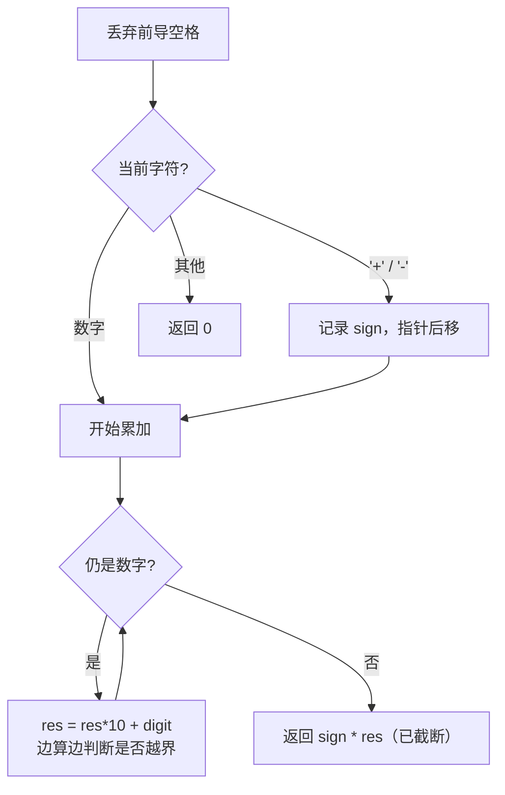

# 8. 字符串转换整数 (atoi)

## 📌 题目

请你来实现一个 `myAtoi(string s)` 函数，使其能将字符串转换成 32 位有符号整数。规则如下：

1. 读入字符串并**丢弃无用的前导空格**；
2. 检查下一个字符（假设还未到字符末尾）为 `'-'` 还是 `'+'`，确定**符号**（两者不存在则默认正）；
3. 读入字符，直到到达**非数字字符**或抵达输入结尾，前面的数字部分即为转换值；
4. 将前面步骤读入的数字转换为整数。若没有读入数字，结果为 **0**；
5. 若整数数超过 32 位有符号整数范围 `[-2³¹, 2³¹-1]`，需将其**截断**到该范围；
6. 返回整数作为最终结果。

```
输入："42"                 输出：42
输入："   -42"             输出：-42
输入："4193 with words"    输出：4193
输入:"-91283472332"        输出：-2147483648   （截断到 INT_MIN）
```

🔗 [LeetCode 8](https://leetcode.cn/problems/string-to-integer-atoi/)

## 🎯 腾讯考察

> **CodeTop 腾讯后端榜 13 次**——字符串模拟经典。腾讯爱考「边界处理是否严谨」，常要求你口述**状态机**写法。

- 来源：[CodeTop 腾讯后端榜](https://github.com/afatcoder/LeetcodeTop/blob/master/tencent/backend.md)
- 考点：**字符串模拟**、**状态机 / 分情况处理**、**整数溢出截断**

## 🛒 人话理解 & 🧠 思路演进



### 生活中的算法

就是「**从一段文字里抠出开头的数字**」：先跳过空格，看正负号，然后一位一位读数字，遇到非数字就停。难点只有一个——**读出来的数可能爆 int**，所以每读一位就要检查是否快超了，超了直接钉在边界上。

### 思路演进

1. **状态机（DFA，官方推荐）**：定义状态（开头 / 符号 / 数字 / 结束）与转移表，按字符驱动。**严谨、可扩展**，但实现稍重，适合面试时口述思路。
2. **直接模拟（推荐）**：按题意一步步走——去空格 → 读符号 → 读数字并**边读边截断**。最贴近人脑逻辑、最好写。

> 💡 **溢出截断技巧**：不必先累加再判断（会真溢出）。每步在「乘 10 加 digit 之前」预判——若 `res > INT_MAX // 10`，或 `res == INT_MAX // 10` 且 `digit > 7`，必定越界，直接按符号返回 `INT_MAX / INT_MIN`。`7` 来自 `INT_MAX = 2147483647` 的末位。

### 复杂度

- 时间：`O(n)`，一次扫描
- 空间：`O(1)`

## 🐍 Python 代码

### 🥊 暴力解（朴素对照）

绕开手动模拟，直接用 `int()` + `try/except` 暴力解析——仅作思路对照，掩盖了状态机/溢出处理的细节。

```python
import re

class Solution:
    def myAtoi(self, s: str) -> int:
        INT_MAX, INT_MIN = 2 ** 31 - 1, -2 ** 31
        # 去空格 → 抽出「可选符号 + 连续数字」前缀 → 直接 int()
        s = s.lstrip()
        m = re.match(r'[+-]?\d+', s)
        if not m:
            return 0
        try:
            val = int(m.group())
        except ValueError:
            return 0
        # 截断到 32 位范围
        if val < INT_MIN:
            return INT_MIN
        if val > INT_MAX:
            return INT_MAX
        return val
```

- 时间复杂度：`O(n)`，正则一次扫描
- 空间复杂度：`O(n)`，正则匹配子串
- ⚠️ 借助 `int()` 绕开了「逐位累加 + 边读边判溢出」的模拟考点，面试会要求手写状态机 → 见下方逐位模拟的最优解。

### ⚡ 最优解

```python
class Solution:
    def myAtoi(self, s: str) -> int:
        INT_MAX, INT_MIN = 2 ** 31 - 1, -2 ** 31
        i, n = 0, len(s)

        # 1. 丢弃前导空格
        while i < n and s[i] == ' ':
            i += 1

        # 2. 读取符号
        sign = 1
        if i < n and s[i] in '+-':
            if s[i] == '-':
                sign = -1
            i += 1

        # 3. 读取数字，边读边判断越界
        res = 0
        while i < n and s[i].isdigit():
            digit = ord(s[i]) - ord('0')

            # 预判越界：res*10 + digit 是否会超过 INT_MAX
            if res > (INT_MAX - digit) // 10:
                return INT_MAX if sign == 1 else INT_MIN

            res = res * 10 + digit
            i += 1

        return sign * res
```

> 💡 越界预判写成 `res > (INT_MAX - digit) // 10` 比拆成两个条件更紧凑且不会漏 `digit > 7` 的情况——`(INT_MAX - digit) // 10` 正好把末位让出来。负数侧共用同一判断，最后用 `sign` 选 `INT_MIN` 即可。

## 🔁 举一反三

- [415. 字符串相加](../字节加餐/0415-字符串相加.md)（字节加餐）—— 同属字符串模拟系列
- [65. 有效数字](https://leetcode.cn/problems/valid-number/) —— 更难的状态机，atoi 的进阶
- [13. 罗马数字转整数](https://leetcode.cn/problems/roman-to-integer/) —— 另一种「字符串转数字」
- [190. 颠倒二进制位](https://leetcode.cn/problems/reverse-bits/) —— 同样需警惕整数边界
