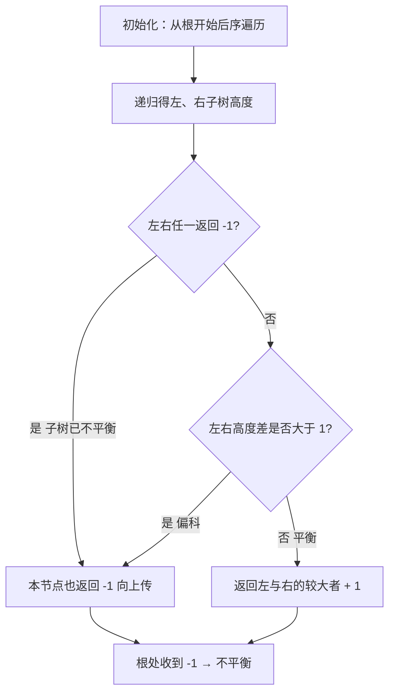
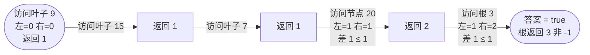

# 110. 平衡二叉树

## 📌 题目

给定一个二叉树，判断它是否是**高度平衡**的。

一棵高度平衡二叉树定义为：**每个节点**的左右两个子树的高度差的绝对值不超过 1。

```
输入：root = [3,9,20,null,null,15,7]
输出：true

输入：root = [1,2,2,3,3,null,null,4,4]
输出：false   （子树早已不平衡）
```

🔗 [LeetCode 110](https://leetcode.cn/problems/balanced-binary-tree/)

## 🎯 腾讯考察

> **CodeTop 腾讯后端榜 6 次**——二叉树 DFS 基本功。腾讯必问的进阶点：「**能不能 O(n) 一次遍历搞定**」——即**自底向上**判断，而不是对每个节点重复算高度。

- 来源：[CodeTop 腾讯后端榜](https://github.com/afatcoder/LeetcodeTop/blob/master/tencent/backend.md)
- 考点：**树 · DFS**、**自底向上（后序遍历）**

## 🛒 人话理解 & 🧠 思路演进



**总体一句话**：后序遍历一遍，用 `-1` 当「不平衡」哨兵——左右子树任一返回 -1 或二者高度差大于 1 就回传 -1，否则回传真实高度，整棵树只遍历一次。

### 🔬 逐步推演（动画式）

以 `root = [3,9,20,null,null,15,7]` 为例——从左到右就是后序遍历的时间线：**每个节点是某节点算完高度时的快照（返回的高度值），箭头上写这一步访问了哪个节点**：



### 生活中的算法

「平衡」就是这棵树**不偏科**——每一层的左右两枝长度差不多。判断时要**从最底层往上**体检：先看每片叶子附近的小枝是否平衡，不平衡就立刻「打报告」（返回 -1），报告一路向上传，根本不用再往上细查；只有下面都平衡，才把自己这层的高度报给上层。

### 思路演进

1. **自顶向下（朴素）`O(n log n)`**：对每个节点，单独调用 `height()` 算左右子树高度并比较，再递归判断左右孩子。`height()` 被反复调用，顶层算一遍，下面又算一遍——大量重复。
2. **自底向上（推荐）`O(n)`**：后序遍历，`height()` 返回值兼任「**是否平衡**」信号：
   - 约定：**不平衡时返回 `-1`**；平衡则返回真实高度。
   - 一个节点先拿到左右子树结果：若任一为 `-1`，或 `|左 − 右| > 1`，本节点也不平衡，返回 `-1`；否则返回 `max(左, 右) + 1`。
   - 整棵树只遍历**一次**，不平衡时提前剪枝。

> 💡 「**用 `-1` 当哨兵**」是后序遍历传递失败信息的经典手法——既报高度、又报「挂了」，一个返回值干两件事，`O(n)` 且零额外标记变量。

### 复杂度

- 时间：`O(n)`，每个节点访问一次
- 空间：`O(n)`，最坏退化为链表时的递归栈

## 🐍 Python 代码

### 🥊 暴力解（朴素对照）

对每个节点单独调用 `height()` 求左右子树高度并比较，再递归判断左右孩子——思路最直白，但高度被反复重算。

```python
class TreeNode:
    def __init__(self, val=0, left=None, right=None):
        self.val = val
        self.left = left
        self.right = right

class Solution:
    def isBalanced(self, root: Optional[TreeNode]) -> bool:
        if not root:
            return True
        # 本节点：左右子树高度差 ≤ 1，且左右子树自身也都平衡
        if abs(self._height(root.left) - self._height(root.right)) > 1:
            return False
        return self.isBalanced(root.left) and self.isBalanced(root.right)

    def _height(self, node):
        """普通求高：每调用一次都把子树全部遍历一遍"""
        if not node:
            return 0
        return max(self._height(node.left), self._height(node.right)) + 1
```

- 时间复杂度：`O(n²)`，最坏（链状树）每个节点都触发一次 `O(n)` 的求高
- 空间复杂度：`O(n)`，递归栈深度
- ⚠️ 高度被重复计算。让 `height()` 在一次后序遍历里**顺便返回是否平衡**（用 `-1` 当哨兵），即可降到 `O(n)` 一次遍历。

### ⚡ 最优解

```python
class TreeNode:
    def __init__(self, val=0, left=None, right=None):
        self.val = val
        self.left = left
        self.right = right

class Solution:
    def isBalanced(self, root: Optional[TreeNode]) -> bool:
        return self._height(root) != -1

    def _height(self, node):
        """返回 node 的高度；若以 node 为根的子树不平衡，返回 -1"""
        if not node:
            return 0

        left = self._height(node.left)
        if left == -1:              # 左子树已不平衡，直接向上传 -1（剪枝）
            return -1
        right = self._height(node.right)
        if right == -1:             # 右子树已不平衡
            return -1

        if abs(left - right) > 1:   # 本节点不平衡
            return -1

        return max(left, right) + 1
```

> 💡 三个 `return -1` 的出口对应三种失败：左挂、右挂、自身偏科。任意一个触发就短路返回，是 `O(n)` 的来源。对比自顶向下的「先算高度再判断」，本写法**判断与求高合一**，是树题里「后序 + 哨兵」的范本。

## 🔁 举一反三

- [104. 二叉树的最大深度](../../09-二叉树/0104-二叉树的最大深度.md)（Hot100）—— 本题 `_height` 的基础
- [543. 二叉树的直径](../../09-二叉树/0543-二叉树的直径.md)（Hot100）—— 同款「后序 + 在递归里顺便统计答案」
- [124. 二叉树中的最大路径和](../../09-二叉树/0124-二叉树中的最大路径和.md)（Hot100）—— 后序遍历传递状态的高阶应用
