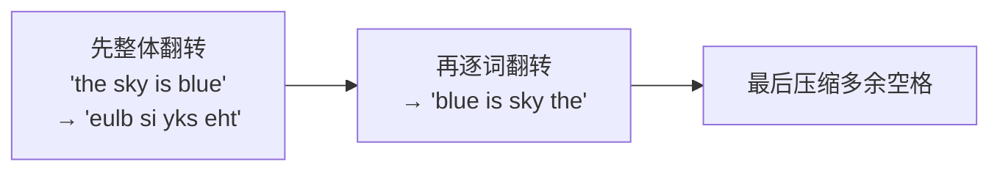

# 151. 翻转字符串里的单词

## 📌 题目

给你一个字符串 `s`，请你反转字符串中**单词的顺序**。

「单词」是由非空格字符组成的字符串。`s` 中使用**至少一个空格**分隔单词。返回反转后、单词间用**单个空格**连接、且**首尾无空格**的结果字符串。

**进阶**：尝试用 `O(1)` 额外空间（即原地）解决。

```
输入：s = "the sky is blue"
输出："blue is sky the"

输入：s = "  hello world  "
输出："world hello"   （前导/尾随空格被去掉，中间多余空格压缩为一个）

输入：s = "a good   example"
输出："example good a"
```

🔗 [LeetCode 151](https://leetcode.cn/problems/reverse-words-in-a-string/)

## 🎯 腾讯考察

> **CodeTop 腾讯后端榜 8 次**——字符串处理高频。腾讯常要求你给出**进阶 `O(1)` 原地解法**（整体翻转 → 逐词翻转 → 清理空格），而不是一句 `split` 带过。

- 来源：[CodeTop 腾讯后端榜](https://github.com/afatcoder/LeetcodeTop/blob/master/tencent/backend.md)
- 考点：**字符串**、**双指针**、**原地翻转（reverse）**

## 🛒 人话理解 & 🧠 思路演进



### 生活中的算法

把一句话**整体倒着读**：「the sky is blue」→「eulb si yks eht」。此时每个单词的字母是反的，但**单词的顺序已经对了**（blue 在最前）。只要再把每个单词**内部翻回来**，顺序和拼写就都对了。这就是「**整体翻 + 逐词翻**」的两步法。

### 思路演进

1. **API（最快）**：`s.split()` 自动按任意空格切分并去空串，逆序后 `' '.join`。Python 里一行搞定，但用了 `O(n)` 额外空间，且没体现「翻转」思想。
2. **双指针原地翻转（进阶推荐）**：把字符串转成可变字符数组，三步完成 `O(1)` 额外空间：
   - **① 整体翻转**；
   - **② 逐词翻转**（每个单词各自翻回来，此时单词顺序、拼写都对了）；
   - **③ 清理空格**：用写指针把多余空格压缩掉。

> 💡 关键直觉：**整体翻转交换的是「单词的相对顺序」，逐词翻转再修正「单词内部字母」**——两步反转互相配合，恰好得到目标。清理空格时「写指针」技巧也能顺带搞定首尾和中间的冗余空格。

### 复杂度

- 时间：`O(n)`
- 空间：API 法 `O(n)`；原地法 `O(1)`（Python 中需转成 `list`，C/C++ 可真·原地）

## 🐍 Python 代码

```python
class Solution:
    def reverseWords(self, s: str) -> str:
        # —— 方法一：API 一行（日常首选）——
        # split() 无参时按任意长度空白切分，自动去掉首尾和多余空格
        return ' '.join(s.split()[::-1])
```

> 进阶 · `O(1)` 原地翻转（面试常被追问）：
> ```python
> class Solution:
>     def reverseWords(self, s: str) -> str:
>         arr = list(s)                    # 转可变数组
>         n = self._clean_and_reverse(arr) # 整体翻 + 逐词翻 + 压缩空格，返回有效长度
>         return ''.join(arr[:n])
>
>     def _clean_and_reverse(self, arr):
>         # ① 整体翻转
>         self._rev(arr, 0, len(arr) - 1)
>         # ② 逐词翻转 + ③ 压缩多余空格
>         write = i = 0
>         n = len(arr)
>         while i < n:
>             while i < n and arr[i] == ' ':   # 跳过空格
>                 i += 1
>             if i >= n:
>                 break
>             if write > 0:                    # 单词间补一个空格
>                 arr[write] = ' '
>                 write += 1
>             start = write
>             while i < n and arr[i] != ' ':   # 拷贝单词
>                 arr[write] = arr[i]
>                 write += 1
>                 i += 1
>             self._rev(arr, start, write - 1) # 翻转刚写入的单词
>         return write
>
>     def _rev(self, arr, lo, hi):
>         while lo < hi:
>             arr[lo], arr[hi] = arr[hi], arr[lo]
>             lo, hi = lo + 1, hi - 1
> ```

> 💡 `s.split()` 与 `s.split(' ')` 区别巨大：**无参** `split()` 把连续空白视作一个分隔符并丢弃首尾空串；带参 `split(' ')` 会保留空串（多个空格产生空元素）。翻转单词题一定要用**无参**版本。

## 🔁 举一反三

- [344. 反转字符串](https://leetcode.cn/problems/reverse-string/) —— 最基础的双指针翻转
- [541. 反转字符串 II](https://leetcode.cn/problems/reverse-string-ii/) —— 带规则的区间翻转
- [557. 反转字符串中的单词 III](https://leetcode.cn/problems/reverse-words-in-a-string-iii/) —— 本题的镜像（只翻字母、不翻单词顺序）
- [186. 翻转字符串里的单词 II](https://leetcode.cn/problems/reverse-words-in-a-string-ii/) —— 无多余空格版，要求 `O(1)` 原地
