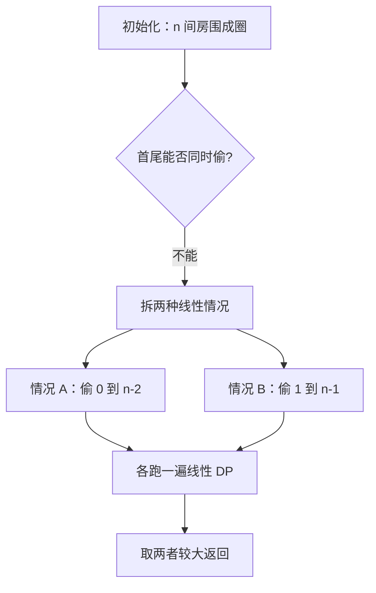

# 213. 打家劫舍 II

## 📌 题目

你是一个专业的小偷，计划偷窃沿街的房屋。每间房内都藏有一定的现金。这个地方**所有的房屋围成一圈**，这意味着第一个房屋和最后一个房屋是紧挨着的（相邻的房屋装有报警系统，**两间相邻的房屋不能同晚偷窃**）。

给定一个代表每个房屋存放金额的非负整数数组，计算你**不触动报警**的情况下，一夜之内能偷窃到的最高金额。

```
输入：nums = [2,3,2]
输出：3
解释：首尾相邻，不能偷 2+2，只能偷中间的 3。

输入：nums = [1,2,3,1]
输出：4
解释：偷 1 号(=1) 和 3 号(=3)：1+3=4。
```

🔗 [LeetCode 213](https://leetcode.cn/problems/house-robber-ii/)

## 🎯 腾讯考察

> **CodeTop 腾讯后端榜 6 次**——[198 打家劫舍](../../16-动态规划/0198-打家劫舍.md)的**环形版**。腾讯考它，看你能否把「环形」**拆解成两个线性子问题**复用 198 的解。

- 来源：[CodeTop 腾讯后端榜](https://github.com/afatcoder/LeetcodeTop/blob/master/tencent/backend.md)
- 考点：**动态规划**、**环形 → 线性拆解**

## 🛒 人话理解 & 🧠 思路演进



**总体一句话**：环形 ⇒ 首尾必有一个不偷，于是把环形拆成两条线性区间，各跑一遍 198 的线性 DP（`dp[i] = max(dp[i-1], dp[i-2] + nums[i])`），取较大值。

### 🔬 逐步推演（动画式）

以 `nums = [1,2,3,1]` 为例——从左到右就是算法的时间线：**每个节点是一次状态快照（区间 / `prev1` 即区间最大金额），箭头上写这一步处理了哪个区间、怎么滚动**：

```mermaid
flowchart LR
    S0(["初始<br/>环形 1,2,3,1"]) -->|"拆情况 A 偷 0~2"| S1["区间 1,2,3<br/>prev1 = 0"]
    S1 -->|"i=0 处理 1<br/>cur = max 0 与 0+1"| S2["prev2=0　prev1=1"]
    S2 -->|"i=1 处理 2<br/>cur = max 1 与 0+2"| S3["prev2=1　prev1=2"]
    S3 -->|"i=2 处理 3<br/>cur = max 2 与 1+3"| S4["情况 A = 4"]
    S4 -->|"拆情况 B 偷 1~3"| S5["区间 2,3,1"]
    S5 -->|"同法滚动 → 3"| S6["情况 B = 3"]
    S6 --> Ans(["答案 = 4<br/>即 max 4 与 3"])
```



### 生活中的算法

圆桌上摆了一圈红包，规则是「**不能拿相邻的**」。难点在于圆桌首尾相接——第 1 个和最后 1 个也是邻居，所以**不能同时拿**。

那就分类讨论：要么**不拿最后一个**（那第 1 个随便拿不拿，问题退化成一条直线 `[0, n-2]`），要么**不拿第一个**（退化成直线 `[1, n-1]`）。两种情况**各跑一遍 198 的直线打家劫舍**，取较大值即可——环形就被「拆」成了两条线。

### 思路演进

1. **直接对环形 DP**：状态里要同时记「首是否被偷」，转移复杂易错。
2. **拆成两条线（推荐）**：首尾相邻 ⇒ **首、尾必有一个不偷**。于是：
   - 情况 A：偷 `[0, n-2]`（不偷最后）
   - 情况 B：偷 `[1, n-1]`（不偷最前）
   - 两者取 `max`。每段都是 198 的线性 DP，`O(1)` 空间滚动。

> 💡 边界：`n == 1` 时首尾是同一间，直接返回 `nums[0]`（两种区间会越界，须单独处理）。这是环形题最常踩的坑。

### 复杂度

- 时间：`O(n)`，两次线性扫描
- 空间：`O(1)`，滚动变量

## 🐍 Python 代码

### 🥊 暴力解（朴素对照）

每间房「偷 / 不偷」回溯枚举所有组合，对环形首尾加约束后取最大——思路最直白。

```python
from typing import List

class Solution:
    def rob(self, nums: List[int]) -> int:
        n = len(nums)
        if n == 1:
            return nums[0]

        # 枚举所有「不相邻」的偷法，递归选/不选
        def dfs(i: int, first_robbed: bool) -> int:
            # i: 当前考虑的下标；first_robbed: 第 0 号是否被偷（用于约束尾房）
            if i >= n:
                return 0
            # 偷当前：需保证与首、尾不冲突
            take = 0
            if i == n - 1:                       # 尾房：首偷过就不能偷
                if not first_robbed:
                    take = nums[i] + dfs(i + 2, first_robbed)
            else:
                take = nums[i] + dfs(i + 2, first_robbed)
            skip = dfs(i + 1, first_robbed)      # 不偷当前
            return max(take, skip)

        # 情况 A：偷首；情况 B：不偷首。两者取大
        return max(nums[0] + dfs(2, True),       # 偷了首，跳过 1，尾房受限
                   dfs(1, False))                # 不偷首，可偷到尾
```

- 时间复杂度：`O(2ⁿ)`，每间房两种选择，指数级枚举
- 空间复杂度：`O(n)`，递归栈深度
- ⚠️ `n` 一大就超时。观察到「环形 ⇒ 首尾必有一偷」，可拆成两段线性区间 → 用 DP 滚动降至 `O(n)` 时间、`O(1)` 空间。

### ⚡ 最优解

```python
from typing import List

class Solution:
    def rob(self, nums: List[int]) -> int:
        n = len(nums)
        if n == 1:
            return nums[0]
        # 首尾不能同偷 → 取「偷 [0,n-2]」与「偷 [1,n-1]」的较大值
        return max(self._rob_line(nums, 0, n - 2),
                   self._rob_line(nums, 1, n - 1))

    def _rob_line(self, nums, lo, hi):
        """198 打家劫舍的线性版：区间 [lo, hi]，O(1) 空间"""
        prev2 = prev1 = 0          # prev2=dp[i-2], prev1=dp[i-1]
        for i in range(lo, hi + 1):
            cur = max(prev1, prev2 + nums[i])
            prev2 = prev1
            prev1 = cur
        return prev1
```

> 💡 `_rob_line` 就是 198 的状态转移 `dp[i] = max(dp[i-1], dp[i-2] + nums[i])`，用两个变量滚动。把它抽成函数，环形题就只剩「**拆区间 + 取 max**」这一步思考，干净利落。

## 🔁 举一反三

- [198. 打家劫舍](../../16-动态规划/0198-打家劫舍.md)（Hot100）—— 本题的前置与核心
- [337. 打家劫舍 III](https://leetcode.cn/problems/house-robber-iii/) —— 树形 DP 版，递归 + 状态转移
- [256. 粉刷房子](https://leetcode.cn/problems/paint-house/) —— 同款「相邻不能取」的 DP 拓展
