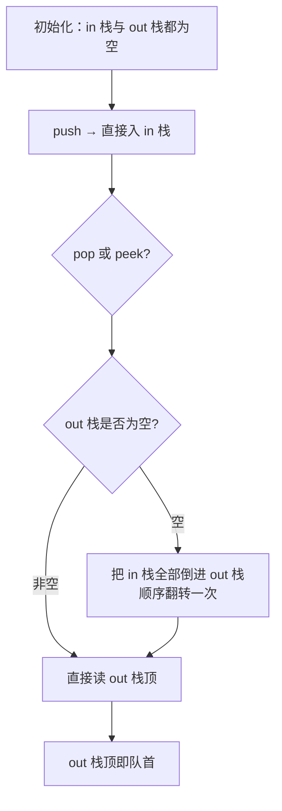
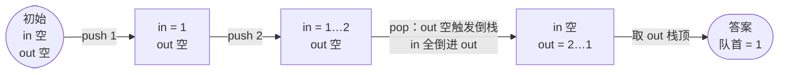

# 232. 用栈实现队列

## 📌 题目

请你仅使用两个栈实现一个先入先出（FIFO）的队列。队列应当支持一般队列的所有操作（`push`、`pop`、`peek`、`empty`）。

你只能使用标准的栈操作（`push to top`、`peek/pop from top`、`size`、`is empty`）。

```
输入：
["MyQueue", "push", "push", "peek", "pop", "empty"]
[[], [1], [2], [], [], []]
输出：[null, null, null, 1, 1, false]
```

🔗 [LeetCode 232](https://leetcode.cn/problems/implement-queue-using-stacks/)

## 🎯 腾讯考察

> **CodeTop 腾讯后端榜 5 次**——栈与队列互转的经典。腾讯爱借此考察「**摊还分析（amortized）**」：为什么看似 `O(n)` 的搬运，均摊下来是 `O(1)`。

- 来源：[CodeTop 腾讯后端榜](https://github.com/afatcoder/LeetcodeTop/blob/master/tencent/backend.md)
- 考点：**双栈**、**摊还时间复杂度**

## 🛒 人话理解 & 🧠 思路演进



**总体一句话**：`push` 进 `in` 栈，`pop`/`peek` 时若 `out` 栈为空就把 `in` 全部倒入 `out`（一次翻转使队首来到栈顶），每个元素一生只搬运一次，均摊 `O(1)`。

### 🔬 逐步推演（动画式）

以 `push 1`、`push 2`、`pop` 为例（栈按「底…顶」记）——从左到右就是队列操作的时间线：**每个节点是一次状态快照（两栈内容），箭头上写这一步做了哪个操作**：



### 生活中的算法

栈是「**只有一头的死胡同**」（后进先出），队列是「**两头通的车队**」（先进先出）。一个栈搞不出队列，但**两个栈可以**——

想象 `in` 栈是一只倒扣的杯子，新来的球总从杯口进。要按「先来先走」取球时，把 `in` 栈的球**全倒进** `out` 栈：原本最先进去的球，倒一次后恰好来到 `out` 栈的顶端，就能先出去了。**「倒」一次 = 顺序翻转一次**，两个栈（两次翻转）就实现了队列。

### 思路演进

1. **每次 pop 都倒一次**：进一个倒一个，单次操作 `O(n)`，太慢。
2. **惰性倒栈（推荐）**：只有当 `out` 栈**空了**，才把 `in` 栈**一次性全部**倒进 `out` 栈。`out` 没空就直接取栈顶，不触发搬运。
   - 关键：每个元素一生只被「倒」一次（`in → out`），所以 `n` 次 `push` + `n` 次 `pop` 总搬运 `n` 次，**均摊每次 `O(1)`**。

> 💡 摊还分析：`n` 个元素，从 `in` 入栈 1 次、倒到 `out` 1 次、从 `out` 出栈 1 次，共 `3n` 次栈操作对应 `n` 次队列操作 → **均摊 `O(1)`**。面试一定要能说出这套「每个元素至多搬运一次」的论证。

### 复杂度

- `push`：`O(1)`
- `pop` / `peek`：均摊 `O(1)`（最坏单次 `O(n)`，触发倒栈）
- 空间：`O(n)`

## 🐍 Python 代码

### 🥊 暴力解（朴素对照）

只用一个栈：`push` 直接入栈，每次 `pop`/`peek` 时把栈倒空到底取队首、再把剩余倒回去——思路最直白，但每次出队都要全量搬运。

```python
class MyQueue:
    def __init__(self):
        self.stack = []          # 单栈：栈顶是最后入队的元素

    def push(self, x: int) -> None:
        self.stack.append(x)

    def pop(self) -> int:
        # 倒空到临时栈，取出栈底（队首），再倒回去
        tmp = []
        while len(self.stack) > 1:
            tmp.append(self.stack.pop())
        front = self.stack.pop()
        while tmp:
            self.stack.append(tmp.pop())
        return front

    def peek(self) -> int:
        tmp = []
        while len(self.stack) > 1:
            tmp.append(self.stack.pop())
        front = self.stack[-1]   # 只看不取
        while tmp:
            self.stack.append(tmp.pop())
        return front

    def empty(self) -> bool:
        return not self.stack
```

- 时间复杂度：`push` `O(1)`；`pop`/`peek` `O(n)`，每次都要把全部元素倒两遍
- 空间复杂度：`O(n)`
- ⚠️ 每次 `pop` 都全量搬运，太慢。引入第二个 `out` 栈**惰性倒栈**（仅 out 空时一次性倒入），每个元素一生只搬运一次，均摊降至 `O(1)`。

### ⚡ 最优解

```python
class MyQueue:
    def __init__(self):
        self.in_stack = []      # 入队栈：只管接 push
        self.out_stack = []     # 出队栈：只管出 pop/peek

    def push(self, x: int) -> None:
        self.in_stack.append(x)

    def pop(self) -> int:
        self._shift()           # 保证 out 栈顶是队首
        return self.out_stack.pop()

    def peek(self) -> int:
        self._shift()
        return self.out_stack[-1]

    def empty(self) -> bool:
        return not self.in_stack and not self.out_stack

    def _shift(self):
        """out 栈空时，把 in 栈全部倒进来（顺序翻转一次）"""
        if not self.out_stack:
            while self.in_stack:
                self.out_stack.append(self.in_stack.pop())
```

> 💡 `pop` 和 `peek` 复用同一个 `_shift()`，保证「只在 out 空时才搬运」，这是摊还 `O(1)` 的前提。`peek` 想偷懒 `return self.pop()` 再 push 回去也行，但多一次搬运，不如直接读 `out_stack[-1]` 干净。

## 🔁 举一反三

- [225. 用队列实现栈](https://leetcode.cn/problems/implement-stack-using-queues/) —— 反向题，单队列每次把前 n-1 个翻到队尾
- [155. 最小栈](../../13-栈/0155-最小栈.md)（Hot100）—— 辅助栈的经典设计
- [20. 有效的括号](../../13-栈/0020-有效的括号.md)（Hot100）—— 栈最经典的应用
