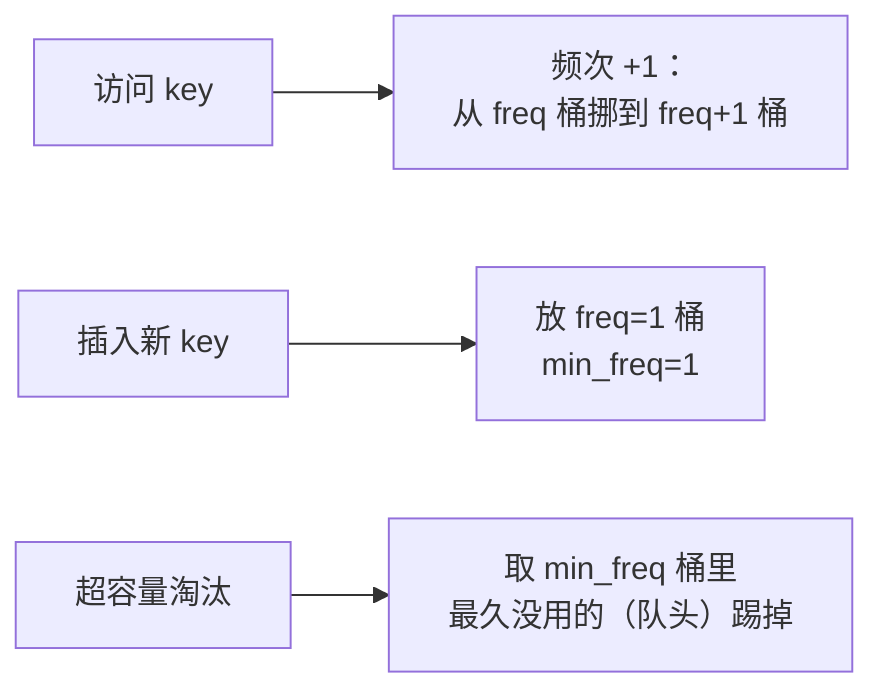

# 460. LFU 缓存

## 📌 题目

请你为**最不经常使用（LFU）**缓存算法设计并实现数据结构。

实现 `LFUCache` 类：

- `LFUCache(int capacity)` —— 用容量 `capacity` 初始化。
- `int get(int key)` —— 若 `key` 存在返回其值，否则返回 `-1`。**访问后该 key 的使用频次 +1**。
- `void put(int key, int value)` —— 若 `key` 已存在则更新值并 +1 频次；否则插入。若插入后超容量，则**淘汰使用频次最少的 key**；当频次并列时，淘汰**最久未使用**的那个（LRU tie-break）。

要求 `get` / `put` 都达到 **`O(1)` 平均时间复杂度**。

```
输入：
["LFUCache","put","put","get","put","get","get"]
[[2],[1,1],[2,2],[1],[3,3],[2],[3]]
输出：[null,null,null,1,null,-1,3]
解释：容量为 2。put(1,1)、put(2,2)、get(1) 使 1 频次=2。
put(3,3) 触发淘汰——2 的频次=1 < 1 的频次=2，故淘汰 2。
随后 get(2) 返回 -1，get(3) 返回 3。
```

🔗 [LeetCode 460](https://leetcode.cn/problems/lfu-cache/)

## 🎯 腾讯考察

> **CodeTop 腾讯后端榜 12 次**——腾讯爱考的**设计题天花板**，是 [146 LRU 缓存](../../08-链表/0146-LRU_缓存.md)的进阶。能写出 `O(1)` 的 LFU，说明你真正吃透了「**哈希 + 链表/有序结构**」这一套。

- 来源：[CodeTop 腾讯后端榜](https://github.com/afatcoder/LeetcodeTop/blob/master/tencent/backend.md)
- 考点：**O(1) 设计**、**频次分桶**、**桶内 LRU（OrderedDict）**

## 🛒 人话理解 & 🧠 思路演进



### 生活中的算法

缓存就像「**座位有限的自习室**」：人太多时谁该让座？LFU 的规矩是——**用得最少的先走**；如果两个人用得一样少，那**更久没来过的**先走。

怎么 `O(1)` 找到该走的人？把所有人按「使用次数」**分进不同的桶**（频次=1 的桶、=2 的桶……），每个桶内按「最近使用时间」排队。维护一个 `min_freq` 指针指向最少的桶，淘汰时直接抓那个桶的**队头**（最久没用的）即可——全是哈希查找，`O(1)`。

### 思路演进

1. **小顶堆**：堆里存 `(freq, time, key)`，淘汰取堆顶。但访问后频次变化要更新堆，`O(log n)`，不达标。
2. **频次分桶 + 桶内 LRU（推荐）**：三张哈希表 + 一个最小频次变量，全部 `O(1)`：
   - `key_to_val`：key → 值
   - `key_to_freq`：key → 使用频次
   - `freq_to_keys`：频次 → **OrderedDict**（同频次内按 LRU 排，队头最旧、队尾最新）
   - `min_freq`：当前最小频次

> 💡 **核心三件事**：① 访问即「频次 +1」= 从旧桶挪到新桶**队尾**；② 淘汰=抓 `min_freq` 桶**队头**；③ 挪空旧桶时，若它正好是 `min_freq`，则 `min_freq += 1`（因为新桶频次恰好多 1）。新插入的 key 频次必为 1，`min_freq` 重置为 1。

### 复杂度

- `get` / `put`：**均摊 `O(1)`**（纯哈希 + OrderedDict 头尾操作）
- 空间：`O(capacity)`

## 🐍 Python 代码

### 🥊 暴力解（朴素对照）

用普通 dict 朴素维护，淘汰时按频次全表扫描找最小——逻辑最直白，但 `get`/`put` 都是 `O(n)`。

```python
class LFUCache:
    def __init__(self, capacity: int):
        self.cap = capacity
        self.key_to_val = {}     # key -> 值
        self.key_to_freq = {}    # key -> 使用频次
        self.key_to_time = {}    # key -> 最近使用时间戳
        self.clock = 0           # 全局时间戳，记录「最近使用顺序」

    def get(self, key: int) -> int:
        if key not in self.key_to_val:
            return -1
        self.key_to_freq[key] += 1
        self.clock += 1
        self.key_to_time[key] = self.clock   # 更新最近使用时间
        return self.key_to_val[key]

    def put(self, key: int, value: int) -> None:
        if self.cap == 0:
            return
        if key in self.key_to_val:
            self.key_to_val[key] = value
            self.key_to_freq[key] += 1
            self.clock += 1
            self.key_to_time[key] = self.clock
            return
        # 满了 → 全表扫描找频次最小（并列取最久未用）
        if len(self.key_to_val) >= self.cap:
            evict = self._least_used()
            del self.key_to_val[evict]
            del self.key_to_freq[evict]
            del self.key_to_time[evict]
        self.key_to_val[key] = value
        self.key_to_freq[key] = 1
        self.clock += 1
        self.key_to_time[key] = self.clock

    def _least_used(self) -> int:
        # O(n) 扫描：频次最小，并列取时间戳最小（最久未用）
        return min(self.key_to_freq, key=lambda k: (self.key_to_freq[k], self.key_to_time[k]))
```

- 时间复杂度：`get` / `put` 均为 `O(n)`（淘汰时全表扫描最小频次）
- 空间复杂度：`O(capacity)`
- ⚠️ 不满足题目 `O(1)` 复杂度要求，仅作思路对照。优化方向：把 key 按**频次分桶**，桶内用 OrderedDict 维护 LRU，维护 `min_freq` 指针，淘汰直接取桶头——见下方最优解。

### ⚡ 最优解

```python
from collections import OrderedDict

class LFUCache:
    def __init__(self, capacity: int):
        self.cap = capacity
        self.key_to_val = {}                 # key -> 值
        self.key_to_freq = {}                # key -> 频次
        self.freq_to_keys = {}               # 频次 -> OrderedDict（LRU）
        self.min_freq = 0

    def get(self, key: int) -> int:
        if key not in self.key_to_val:
            return -1
        self._inc_freq(key)                  # 访问一次，频次 +1
        return self.key_to_val[key]

    def put(self, key: int, value: int) -> None:
        if self.cap == 0:
            return
        if key in self.key_to_val:           # 已存在：更新值 + 频次 +1
            self.key_to_val[key] = value
            self._inc_freq(key)
            return

        # 容量满 → 淘汰 min_freq 桶里最久未用的（队头）
        if len(self.key_to_val) >= self.cap:
            evict = next(iter(self.freq_to_keys[self.min_freq]))
            self.freq_to_keys[self.min_freq].popitem(last=False)
            if not self.freq_to_keys[self.min_freq]:
                del self.freq_to_keys[self.min_freq]
            del self.key_to_val[evict]
            del self.key_to_freq[evict]

        # 插入新 key：频次从 1 开始
        self.key_to_val[key] = value
        self.key_to_freq[key] = 1
        self.freq_to_keys.setdefault(1, OrderedDict())[key] = None
        self.min_freq = 1                    # 新 key 频次必为 1

    def _inc_freq(self, key: int):
        """频次 +1：从旧桶队尾挪到新桶队尾；旧桶空且是 min_freq 则 min_freq+1"""
        f = self.key_to_freq[key]
        bucket = self.freq_to_keys[f]
        bucket.pop(key)                      # 移出旧桶
        if not bucket:
            del self.freq_to_keys[f]
            if self.min_freq == f:           # 旧桶正好是最小频次桶
                self.min_freq += 1

        nf = f + 1
        self.key_to_freq[key] = nf
        self.freq_to_keys.setdefault(nf, OrderedDict())[key] = None   # 进新桶队尾（最新）
```

> 💡 `OrderedDict` 的两个动作定调：`popitem(last=False)` 删**队头**（最旧，用于淘汰）；给新 key 赋值 `[key] = None` 会把它放到**队尾**（最新，体现「刚用过」）。把握住「队头最旧、队尾最新」就不会乱。

## 🔁 举一反三

- [146. LRU 缓存](../../08-链表/0146-LRU_缓存.md)（Hot100）—— LFU 的前置题，先彻底搞懂 LRU
- [432. 全 O(1) 的数据结构](https://leetcode.cn/problems/all-oone-data-structure/) —— LFU 的进阶，双向链表 + 哈希
- [O(1) 时间插入、删除和获取随机元素](https://leetcode.cn/problems/insert-delete-getrandom-o1/)（380）—— 另一类 `O(1)` 设计：哈希 + 数组下标交换
