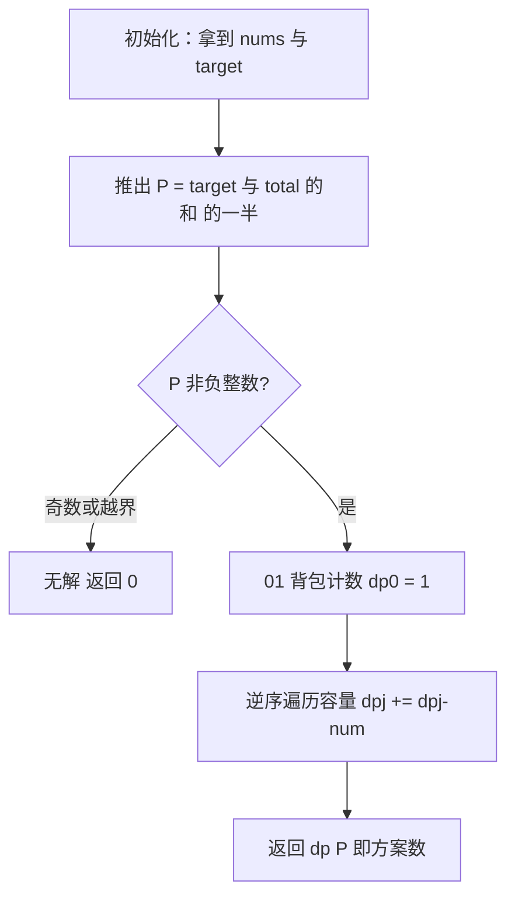
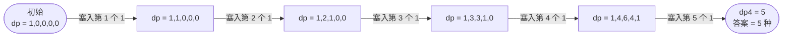

# 494. 目标和

## 📌 题目

给你一个非负整数数组 `nums` 和一个整数 `target`。

向数组中的每个整数前添加 `'+'` 或 `'-'`，然后串联起所有整数，可以构造一个**表达式**。返回可以通过上述方法构造的、**运算结果等于 `target`** 的不同表达式的数目。

```
输入：nums = [1,1,1,1,1], target = 3
输出：5
解释：共有 5 种组合得到 +1+1+1+1+1、-1+1+1+1+1 ... 共 5 种最终等于 3。

输入：nums = [1], target = 1
输出：1
```

🔗 [LeetCode 494](https://leetcode.cn/problems/target-sum/)

## 🎯 腾讯考察

> **CodeTop 腾讯后端榜 6 次**——**01 背包计数**的代表题。腾讯爱用它考察你能否把「凑符号」**转化为「子集和」**，从而把指数级回溯降维成 DP。

- 来源：[CodeTop 腾讯后端榜](https://github.com/afatcoder/LeetcodeTop/blob/master/tencent/backend.md)
- 考点：**动态规划**、**01 背包变形（计数）**、**回溯 → DP 的转化**

## 🛒 人话理解 & 🧠 思路演进



**总体一句话**：把「凑 +/− 等于 target」转化为「挑一个子集和恰为 `P = (target+total)/2`」，再用一维 01 背包计数（逆序遍历、`dp[j] += dp[j-num]`）数出方案数。

### 🔬 逐步推演（动画式）

以 `nums = [1,1,1,1,1]`，`target = 3` 为例——`total = 5`，`P = (5+3)/2 = 4`，从左到右就是背包滚动的时间线：**每个节点是一次状态快照（处理完该数后的 `dp` 数组），箭头上写这一步塞进了哪个数**：



### 生活中的算法

把每个数「加号 / 减号」想成「**放进正组还是负组**」。要使 `正组之和 − 负组之和 = target`，而 `正组 + 负组 = 总和` 是固定的。两个式子一算，就能定出**正组之和 P 必须是多少**。于是问题变成：「**从这些数里挑出一部分，和恰好等于 P，有多少种挑法？**」——这正是 01 背包的计数版。

### 思路演进

1. **回溯（DFS）**：每个数选 `+` 或 `-`，`2ⁿ` 种组合，超时。
2. **记忆化搜索**：`dfs(i, cur_sum)`，状态数 `O(n·sum)`，能过但空间大。
3. **转化为 01 背包（推荐）**：
   - 设 `P` 为加 `+` 的数之和、`N` 为加 `-` 的数之和。由 `P − N = target` 与 `P + N = total` 解得 `P = (target + total) / 2`。
   - **可行性剪枝**：若 `target + total` 为负或为奇数，`P` 非整数，**无解返回 0**；若 `abs(target) > total`，也必无解。
   - 求从 `nums` 中选出和恰为 `P` 的**方案数**：一维 01 背包 `dp[j] += dp[j − num]`。

> 💡 **转化直觉**：「凑 +/− 等于 target」⇔「找一个子集，和为 `(target+total)/2`」。前者是 `2ⁿ` 枚举，后者是 `O(n·sum)` 背包——这就是「**建模即降维**」。

### 复杂度

- 时间：`O(n · sum)`，`sum` 为数组总和
- 空间：`O(P)` ≤ `O(sum)`，一维滚动

## 🐍 Python 代码

### 🥊 暴力解（朴素对照）

每个数前要么填 `+`、要么填 `-`，回溯枚举全部 `2ⁿ` 种组合，数出等于 `target` 的方案数——思路最直白。

```python
from typing import List

class Solution:
    def findTargetSumWays(self, nums: List[int], target: int) -> int:
        n = len(nums)
        self.ans = 0

        def dfs(i: int, cur: int):
            # i: 当前处理到第几个数；cur: 截止目前的表达式值
            if i == n:
                if cur == target:
                    self.ans += 1
                return
            dfs(i + 1, cur + nums[i])    # 给 nums[i] 填 +
            dfs(i + 1, cur - nums[i])    # 给 nums[i] 填 -

        dfs(0, 0)
        return self.ans
```

- 时间复杂度：`O(2ⁿ)`，每个数两种符号选择，指数级枚举
- 空间复杂度：`O(n)`，递归栈深度
- ⚠️ `n` 一大就超时。发现「凑 +/− 等于 target」⇔「挑一个子集和恰为 `(target+total)/2`」→ 转化为 01 背包计数，降至 `O(n·sum)`。

### ⚡ 最优解

```python
from typing import List

class Solution:
    def findTargetSumWays(self, nums: List[int], target: int) -> int:
        total = sum(nums)

        # 剪枝：target+total 非偶或绝对值越界 → 无解
        if (total + target) % 2 != 0 or abs(target) > total:
            return 0

        P = (total + target) // 2    # 正组的目标和

        # 01 背包计数：dp[j] = 和为 j 的选法数
        dp = [0] * (P + 1)
        dp[0] = 1                    # 和为 0 有 1 种（什么都不选）

        for num in nums:
            for j in range(P, num - 1, -1):   # 逆序，保证每个数只用一次
                dp[j] += dp[j - num]

        return dp[P]
```

> 💡 **01 背包计数模板**：`dp[0] = 1`，外层遍历物品、内层**容量逆序**（逆序是「每个物品只用一次」的关键，正序会变成完全背包）。`dp[j] += dp[j − num]` 的含义是「凑出 `j` 的方案数 += 凑出 `j − num` 的方案数」。和 [416 分割等和子集](../../16-动态规划/0416-分割等和子集.md)是同一套代码，只是把 `=` 换成 `+=`。

## 🔁 举一反三

- [416. 分割等和子集](../../16-动态规划/0416-分割等和子集.md)（Hot100）—— 01 背包判定（能否凑出），本题是其计数版
- [279. 完全平方数](../../16-动态规划/0279-完全平方数.md)（Hot100）—— 完全背包（物品可重复用）
- [474. 一和零](https://leetcode.cn/problems/ones-and-zeroes/) —— 二维 01 背包
- 回溯 + 记忆化 —— 本题的另一种写法，面试可顺带提及
