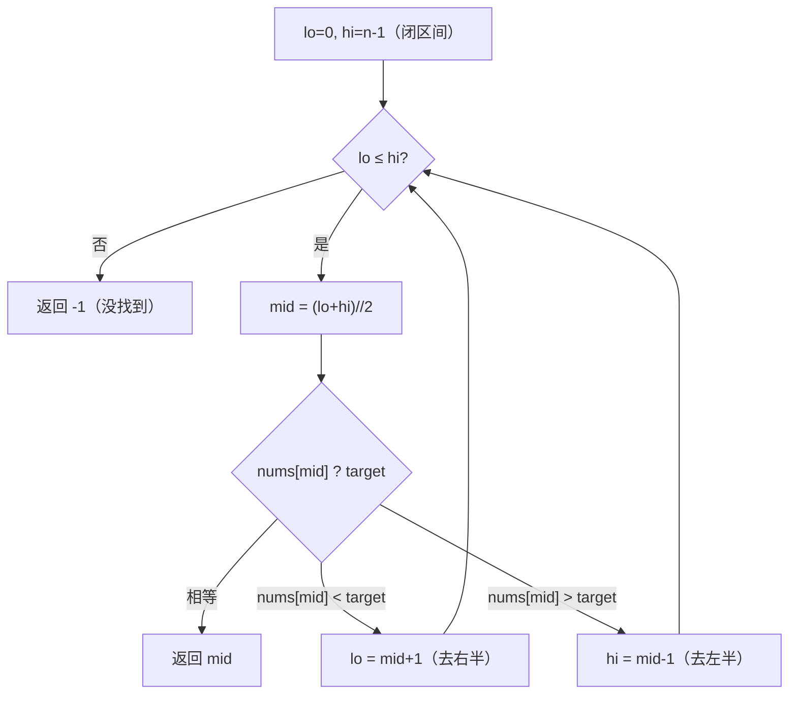

# 704. 二分查找

## 📌 题目

给定一个 `n` 个元素**升序**的整数数组 `nums` 和一个目标值 `target`，写一个函数搜索 `nums` 中的 `target`，若存在返回其下标，否则返回 `-1`。

```
输入：nums = [-1,0,3,5,9,12], target = 9
输出：4
解释：9 出现在下标 4

输入：nums = [-1,0,3,5,9,12], target = 2
输出：-1
```

🔗 [LeetCode 704](https://leetcode.cn/problems/binary-search/)

## 🎯 腾讯考察

> **CodeTop 腾讯后端榜 10 次**——最朴素的二分，腾讯常作**热身题**开场，顺带考察你「**区间定义 / 边界写法**」是否清晰（`<=` 还是 `<`，`mid±1` 还是 `mid`）。

- 来源：[CodeTop 腾讯后端榜](https://github.com/afatcoder/LeetcodeTop/blob/master/tencent/backend.md)
- 考点：**二分查找**、**闭区间 `[lo, hi]` 边界**

## 🛒 人话理解 & 🧠 思路演进



### 生活中的算法

「猜数字」游戏：我从 1~100 里想一个数，你每次猜中间值，我告诉你「大了」或「小了」，你每猜一次就能排除一半。100 个数最多 7 次必中——这就是二分的威力，`log₂(n)` 次就够。

### 思路演进

1. **线性扫描**：从头到尾一个个找。`O(n)`，没利用「**有序**」这个关键条件。
2. **二分（推荐）**：数组有序 → 比一次 `mid`，就能确定 target 在**左半还是右半**，每次砍掉一半，`O(log n)`。

> 💡 二分的**唯一难点是边界**。推荐统一用**闭区间 `[lo, hi]`**：循环条件 `lo <= hi`（`lo == hi` 时区间还有一个元素，要查），更新写 `lo = mid + 1` / `hi = mid - 1`（因为 `mid` 已查过）。一套模板不会乱。

### 复杂度

- 时间：`O(log n)`，每次砍一半
- 空间：`O(1)`

## 🐍 Python 代码

### 🥊 暴力解（朴素对照）

从头到尾一个个找——线性扫描，完全没利用「有序」这个关键条件。

```python
from typing import List

class Solution:
    def search(self, nums: List[int], target: int) -> int:
        for i, x in enumerate(nums):
            if x == target:
                return i
        return -1
```

- 时间复杂度：`O(n)`，最坏要扫遍整个数组
- 空间复杂度：`O(1)`
- ⚠️ 数组有序时一个个比较太浪费——比一次 `mid` 就能确定 target 在左半还是右半 → 演进到下方每次砍一半的 `O(log n)` 二分。

### ⚡ 最优解

```python
from typing import List

class Solution:
    def search(self, nums: List[int], target: int) -> int:
        lo, hi = 0, len(nums) - 1        # 闭区间 [lo, hi]

        while lo <= hi:
            mid = (lo + hi) // 2
            if nums[mid] == target:
                return mid
            elif nums[mid] < target:
                lo = mid + 1             # target 在右半
            else:
                hi = mid - 1             # target 在左半

        return -1
```

> 💡 防 `mid` 溢出写法 `mid = lo + (hi - lo) // 2`（C++/Java 大数组更稳），Python 整数无上限可忽略，但养成习惯面试加分。

## 🔁 举一反三

- [35. 搜索插入位置](../../12-二分查找/0035-搜索插入位置.md)（Hot100）—— 没找到时返回「应插入位置」，二分左边界变体
- [34. 在排序数组中查找元素的第一个和最后一个位置](../../12-二分查找/0034-在排序数组中查找元素的第一个和最后一个位置.md)（Hot100）—— 左/右边界二分
- [69. x 的平方根](../字节加餐/0069-x的平方根.md)（字节加餐）—— 二分答案
- [153. 寻找旋转排序数组中的最小值](../../12-二分查找/0153-寻找旋转排序数组中的最小值.md)（Hot100）—— 旋转数组的二分
