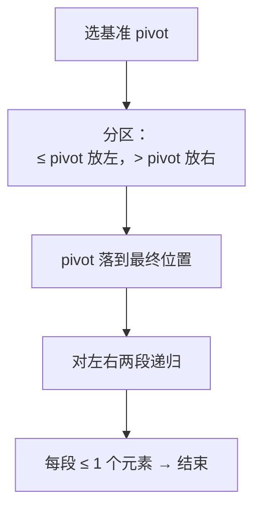

# 912. 排序数组（手撕快速排序）

## 📌 题目

给你一个整数数组 `nums`，请你将该数组**升序排列**，返回排序后的数组。

```
输入：nums = [5,2,3,1]
输出：[1,2,3,5]

输入：nums = [5,1,1,2,0,0]
输出：[0,0,1,1,2,5]
```

🔗 [LeetCode 912](https://leetcode.cn/problems/sort-an-array/)

## 🎯 腾讯考察

> **CodeTop 腾讯后端榜 24 次**——腾讯**招牌题**，频次仅次于 LRU / 反转链表。腾讯面试**明确要求手写排序**，不接受 `sort()` 一行带过。

- 来源：[CodeTop 腾讯后端榜](https://github.com/afatcoder/LeetcodeTop/blob/master/tencent/backend.md)
- 考点：**快速排序**、**划分（partition）**、**随机化基准避免最坏情况**

## 🛒 人话理解 & 🧠 思路演进



### 生活中的算法

老师让一群身高不一的学生排队：先随便挑一个人当「标尺」，比他矮的站左边、比他高的站右边；然后左右两堆**各自再挑标尺、再分**，直到每堆只剩一个人——队就排好了。这就是「快排」。

### 思路演进

1. **选择排序（朴素）**：每轮挑最小值放前面。`O(n²)`，没利用比较信息。
2. **快排（推荐）**：每轮分区后，pivot **一次性落到最终位置**，且左右两段天然独立——分治。
   - **划分方式**：Lomuto（单指针从头扫，最常考、最好写）或 Hoare（双指针对向，交换次数少）。
   - **随机化基准**：固定取首/尾元素，遇到**有序或逆序**输入会退化到 `O(n²)`，LeetCode 912 直接 TLE。**随机选 pivot** 把最坏情况概率抹平。

> 💡 912 的坑：Python 用**朴素快排**会 TLE（有序用例 + 递归开销）。两个修法——① 随机 pivot；② 重复元素多用**三路划分**（< / = / > pivot 三段），等于 pivot 的不再递归。下面给随机化 Lomuto 版，三路划分见「举一反三」。

### 复杂度

- 时间：平均 `O(n log n)`，最坏 `O(n²)`（随机化后几乎不触发）
- 空间：`O(log n)`，递归栈

## 🐍 Python 代码

### 🥊 暴力解（朴素对照）

每轮挑出剩余元素里的最小值，依次放到前面——选择排序，最朴素的排序思路。

```python
from typing import List

class Solution:
    def sortArray(self, nums: List[int]) -> List[int]:
        n = len(nums)
        for i in range(n):                  # 已排好段 [0, i)
            min_idx = i
            for j in range(i + 1, n):       # 在剩余段里找最小值
                if nums[j] < nums[min_idx]:
                    min_idx = j
            nums[i], nums[min_idx] = nums[min_idx], nums[i]   # 换到位置 i
        return nums
```

- 时间复杂度：`O(n²)`，双重循环
- 空间复杂度：`O(1)`，原地排序
- ⚠️ 没利用比较信息（每轮从头扫，比较结果一次性丢弃）→ 快排用分治让 pivot 一次落位、左右独立，降到平均 `O(n log n)`。

### ⚡ 最优解

```python
import random
from typing import List

class Solution:
    def sortArray(self, nums: List[int]) -> List[int]:
        self._quick_sort(nums, 0, len(nums) - 1)
        return nums

    def _quick_sort(self, nums, lo, hi):
        if lo >= hi:
            return
        # 随机选 pivot 并换到末尾（Lomuto 约定 pivot 在 hi）
        rand_idx = random.randint(lo, hi)
        nums[rand_idx], nums[hi] = nums[hi], nums[rand_idx]

        p = self._partition(nums, lo, hi)   # pivot 最终位置
        self._quick_sort(nums, lo, p - 1)
        self._quick_sort(nums, p + 1, hi)

    def _partition(self, nums, lo, hi):
        """Lomuto 划分：≤ pivot 的依次交换到前部"""
        pivot = nums[hi]
        i = lo                          # i 指向「≤ pivot 段」的右边界
        for j in range(lo, hi):
            if nums[j] <= pivot:
                nums[i], nums[j] = nums[j], nums[i]
                i += 1
        nums[i], nums[hi] = nums[hi], nums[i]   # pivot 归位
        return i
```

> 💡 **手撕模板记忆点**：选 pivot → 换到 `hi` → Lomuto 单指针扫 `[lo, hi-1]`，把 `≤ pivot` 的往前塞 → 最后 pivot 放回 `i`。三步即可默写。

## 🔁 举一反三

- [补充题 6. 手撕堆排序](补充题6-手撕堆排序.md)（本目录）—— 腾讯与快排**成对考察**的另一种排序
- [215. 数组中的第 K 个最大元素](../../14-堆/0215-数组中的第_K_个最大元素.md)（Hot100）—— 快速选择，快排分区思想的直接应用
- [148. 排序链表](../../08-链表/0148-排序链表.md)（Hot100）—— 链表上的归并排序（链表不适合快排）
- 三路划分快排（荷兰国旗问题）—— 处理大量重复元素，912 的进阶写法
