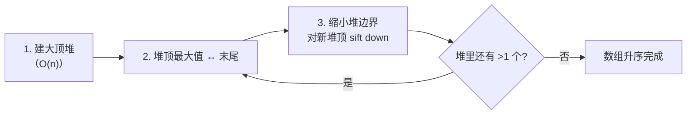

# 补充题 6. 手撕堆排序

## 📌 题目

给你一个整数数组 `nums`，请你使用**堆排序（Heap Sort）**将其**升序排列**，返回排序后的数组。不得调用语言自带的排序函数。

> 该题对应 LeetCode [912. 排序数组](https://leetcode.cn/problems/sort-an-array/)——面试中常要求「用堆排实现」。

```
输入：nums = [4,2,5,1,6,3]
输出：[1,2,3,4,5,6]
```

🔗 [LeetCode 912](https://leetcode.cn/problems/sort-an-array/)

## 🎯 腾讯考察

> **CodeTop 腾讯后端榜 9 次**——腾讯爱把**快排 + 堆排成对考察**：「快排写完，再写个堆排」。会堆排 = 真懂「堆」这个数据结构。

- 来源：[CodeTop 腾讯后端榜](https://github.com/afatcoder/LeetcodeTop/blob/master/tencent/backend.md)
- 考点：**建堆（heapify）**、**下沉（sift down）**、**原地排序**

## 🛒 人话理解 & 🧠 思路演进



### 生活中的算法

「擂台赛」选拔冠军：先让所有人两两比拼、层层往上（**建堆**），最强的人站到塔顶（堆顶）；把他「颁完奖」请到队伍最末尾（**换到末尾**），剩下的人重新打擂决出新冠军，再请到倒数第二……重复 n 次，从后往前就排好了。

升序用**大顶堆**：每次把全局最大换到末尾，末尾逐渐填满从大到小的结果。

### 思路演进

1. **选择排序（朴素）**：每轮扫一遍找最大，`O(n²)`，每次比较的信息没保留。
2. **堆排序（推荐）**：把数组看作**完全二叉树**，用「堆」维护「当前最大值在根」这一性质：
   - **建堆**：从最后一个非叶子节点（下标 `n//2 - 1`）开始，**自右向左、自下而上**对每个节点 `sift down`。看似 `O(n log n)`，实际均摊 `O(n)`。
   - **排序**：循环 `i` 从 `n-1` 到 `1`——交换 `nums[0]`（当前最大）与 `nums[i]`，再对 `nums[0]` 在 `[0, i)` 范围内 `sift down` 恢复堆序。

> 💡 下标关系（0 基）：节点 `i` 的父节点 `(i-1)//2`，左孩子 `2i+1`，右孩子 `2i+2`。这是堆所有操作的基石，**必背**。

### 复杂度

- 时间：建堆 `O(n)` + 排序 `O(n log n)` = **`O(n log n)`**，且最好最坏都是 `O(n log n)`（不像快排会退化）
- 空间：`O(1)`，原地排序

## 🐍 Python 代码

### 🥊 暴力解（朴素对照）

相邻元素两两比较、把大的逐趟「冒」到末尾——冒泡排序，最朴素的排序思路。

```python
from typing import List

class Solution:
    def sortArray(self, nums: List[int]) -> List[int]:
        n = len(nums)
        for i in range(n):                       # 每趟把当前最大值冒到末尾
            swapped = False
            for j in range(0, n - i - 1):        # 已排好段 [n-i, n) 无需再比
                if nums[j] > nums[j + 1]:
                    nums[j], nums[j + 1] = nums[j + 1], nums[j]
                    swapped = True
            if not swapped:                       # 本趟无交换 → 已有序，提前结束
                break
        return nums
```

- 时间复杂度：`O(n²)`，双重循环
- 空间复杂度：`O(1)`，原地排序
- ⚠️ 每次比较只换来相邻交换、没保留信息 → 堆排序把数组组织成完全二叉树，用「堆」维护「最大值在根」，每次 O(log n) 恢复堆序，整体降到 `O(n log n)`。

### ⚡ 最优解

```python
from typing import List

class Solution:
    def sortArray(self, nums: List[int]) -> List[int]:
        n = len(nums)

        # 1. 建大顶堆：从最后一个非叶子节点开始 sift down
        for i in range(n // 2 - 1, -1, -1):
            self._sift_down(nums, i, n)

        # 2. 反复把堆顶最大值换到末尾，再缩小堆
        for end in range(n - 1, 0, -1):
            nums[0], nums[end] = nums[end], nums[0]   # 最大值归位
            self._sift_down(nums, 0, end)             # 在 [0, end) 内恢复堆序

        return nums

    def _sift_down(self, nums, i, size):
        """大顶堆下沉：把 nums[i] 下沉到合适位置，size 为堆的有效长度"""
        while True:
            left, right = 2 * i + 1, 2 * i + 2
            largest = i
            if left < size and nums[left] > nums[largest]:
                largest = left
            if right < size and nums[right] > nums[largest]:
                largest = right
            if largest == i:          # 已经比孩子都大，到位
                break
            nums[i], nums[largest] = nums[largest], nums[i]
            i = largest               # 继续往下沉
```

> 💡 升序用**大顶堆**、降序用**小顶堆**——保证每次换到末尾的是「当前极值」。`sift_down` 的循环条件是「还能和更大的孩子交换」，这是手撕堆的核心，务必默写到肌肉记忆。

## 🔁 举一反三

- [912. 排序数组（手撕快速排序）](0912-排序数组.md)（本目录）—— 快排，腾讯成对考察的另一半
- [215. 数组中的第 K 个最大元素](../../14-堆/0215-数组中的第_K_个最大元素.md)（Hot100）—— 建小顶堆维护 Top-K，堆的直接应用
- [295. 数据流的中位数](../../14-堆/0295-数据流的中位数.md)（Hot100）—— 大小顶堆对偶
- [347. 前 K 个高频元素](../../14-堆/0347-前_K_个高频元素.md)（Hot100）—— 堆 + 哈希计数
