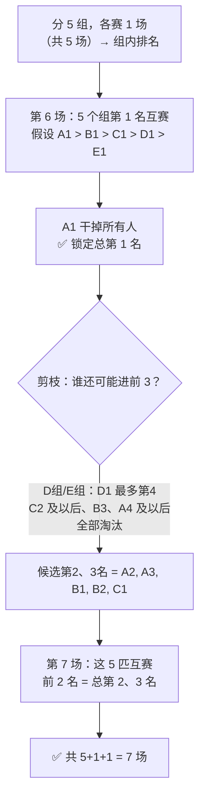

# P01. 25 匹马 5 赛道找前 3 名

## 📌 题目

25 匹马，5 条赛道，**没有计时器**（只知道每场比赛的名次顺序，不知道具体用时）。最少比多少场，能**确定**出速度最快的 **3 匹马**？

🔗 腾讯 / 字节招牌智力题

## 🎯 考察

- **类型**：统筹优化
- **内核**：**分组 + 决策树剪枝**——用每场比赛的"相对名次"最大化排除候选
- **出处**：腾讯招牌，字节也曾考

## 🛒 人话理解 & 🧠 思路演进

### 生活中的推理

没有计时器，就只能靠**名次的传递性**推理。思路分三步：

1. **分组预排（5 场）**：25 匹分 5 组，每组 5 匹各赛一场，得到每组内部 1~5 名。组内第 4、5 名肯定进不了总前 3，淘汰。
2. **冠军之争（第 6 场）**：让 5 个组的「第 1 名」赛一场。假设结果是 `A1 > B1 > C1 > D1 > E1`：
   - `A1` 赢了所有人 → **总第 1 名锁定**。
   - **剪枝**（关键）：`D1` 前面至少有 A1、B1、C1，最多只能第 4 → **D 组、E 组全部淘汰**；`C1` 最多第 3，所以 `C2、C3` 淘汰；`B1` 最多第 2、`B2` 最多第 3，`B3` 淘汰；同理 `A4、A5` 淘汰。
   - 还能争第 2、3 名的只剩 **5 匹：A2、A3、B1、B2、C1**。
3. **争二三名（第 7 场）**：这 5 匹再赛一场，取前 2 名，就是总第 2、3 名。

## 💡 答案

**最少 7 场**：5 场分组 + 1 场冠军赛 + 1 场候选赛。

## 🔁 举一反三

- **64 匹马 8 赛道找前 4**：同一套路——分组、冠军赛、再剪枝候选，场次相应增加。
- **25 匹马找前 5**：候选更多（要保留到第 5 名），第 7 场的候选集更大，需多赛。
- **核心套路**：每场比赛都要"淘汰尽可能多的马"，靠传递性层层剪枝，把候选压缩到"一场能决出"的规模。
