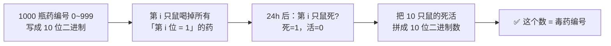

# P02. 1000 瓶药找 1 瓶毒（小白鼠试毒）

## 📌 题目

1000 瓶药，**恰好 1 瓶有毒**。毒药喝下后**正好 24 小时发作致死**。你只有 **24 小时**（只能测一次），最少用几只小白鼠能**确定**哪瓶是毒药？

🔗 字节招牌智力题

## 🎯 考察

- **类型**：信息编码
- **内核**：**二进制编码 / 信息论**——每只鼠就是 1 个 bit
- **出处**：字节招牌，高频变体极多

## 🛒 人话理解 & 🧠 思路演进

### 关键洞察

每只小白鼠只有 **2 种状态**（死 / 活），就是一个**二进制位（bit）**。n 只鼠最多能区分 **2ⁿ 种**情况。

> 2⁹ = 512 < 1000 < 1024 = 2¹⁰ → **至少需要 10 只**。

### 怎么操作

1. 把 1000 瓶药编号 `0 ~ 999`，每瓶编号写成 **10 位二进制**。
2. 第 `i` 只鼠（i = 0…9）：喝掉所有「编号第 i 位 = 1」的药。
3. 24 小时后读结果：第 i 只鼠**死了** → 毒药编号第 i 位 = **1**；**活着** → = **0**。
4. 把 10 只鼠的死活状态拼成一个 10 位二进制数 → **就是毒药的编号**。

**举例**：若第 0、3、7 只鼠死了，其余活着，则毒药编号 = `2⁰ + 2³ + 2⁷` = `1 + 8 + 128` = **137 号**。

## 💡 答案

**最少 10 只小白鼠**（2¹⁰ = 1024 > 1000 ≥ 2⁹）。

## 🔁 举一反三

- **N 瓶药 2 瓶毒**：单个 bit 不够，需要用「组合编码」区分多个毒源，所需鼠数上升。
- **有 2 天时间（测 2 轮）**：每只鼠状态变 3 种（第1天死 / 第2天死 / 没死），信息量暴增，所需鼠数大减——本质是 base-3 编码。
- **核心**：所需"探测器"数 = ⌈log₂(状态数)⌉。识别"用最少测量榨取最多信息"的思维。
