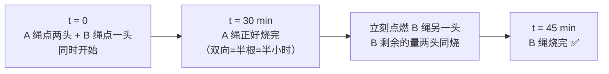

# P03. 烧绳子计时 45 分钟

## 📌 题目

两根材质**不均匀**的绳子，每根从一头点燃后，正好 **1 小时**烧完（但燃烧速度不均匀，**不能**按长度折半估算）。只有绳子和打火机，如何准确量出 **45 分钟**？

🔗 经典通用题（外企 / 大厂）

## 🎯 考察

- **类型**：逆向思维
- **内核**：**双向燃烧 = 时间减半**（与是否均匀无关）
- **出处**：经典智力题，流传极广

## 🛒 人话理解 & 🧠 思路演进

### 突破口

绳子虽然不均匀，但有一条性质恒成立：

> **同时点燃一根绳的两头，它一定在 30 分钟烧完。**

因为两端相向燃烧，无论哪里快哪里慢，相遇那一刻整根刚好烧尽，总燃烧量 = 1 根 = 半小时。

### 操作步骤

1. **t = 0**：A 绳点**两头** + B 绳点**一头**，同时开始。
2. **t = 30 分钟**：A 绳烧完。此时 B 绳已经烧了 30 分钟，**还剩 30 分钟的量**。
3. 立刻点燃 B 绳**另一头**：B 剩下的量两头同时烧，只需 **15 分钟**烧完。
4. B 烧完的时刻 = 30 + 15 = **45 分钟**。

## 💡 答案

**点 A 两头 + B 一头同时开始；A 烧完（30min）时立即点 B 另一头；B 烧完即 45 分钟。**

## 🔁 举一反三

- **量 15 分钟**：先按上法让 B 剩 30 分钟的量，再两头点 → 15 分钟。
- **量 1 小时**：点一根的一头即可。
- **核心**：单向燃烧 = 1 倍速，双向燃烧 = 2 倍速。靠"同时点燃的头数"控制燃烧速率，绕开"不均匀"的干扰。
