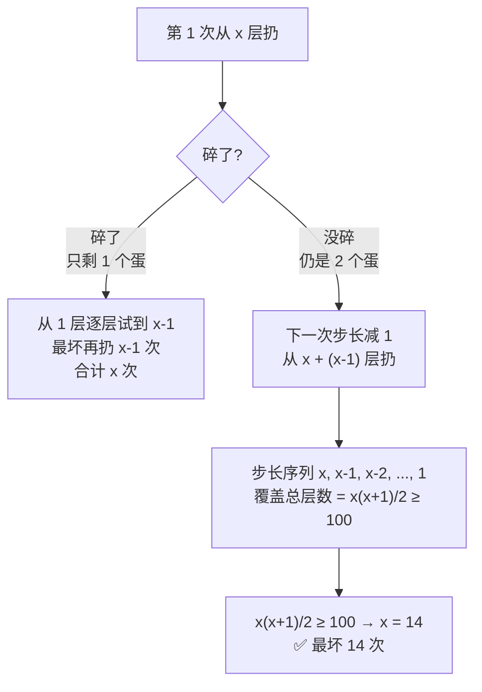

# P04. 100 层楼 2 个鸡蛋

## 📌 题目

100 层楼，2 个**一模一样**的鸡蛋。存在临界层 F：鸡蛋从 **≥ F 层**扔下会碎，**< F 层**不会碎。设计一个扔法，使**最坏情况下扔的次数最少**，从而确定 F。（鸡蛋一旦碎了就不能再用）

🔗 字节 / 腾讯招牌题；原形见 [LeetCode 887. 鸡蛋掉落](https://leetcode.cn/problems/super-egg-drop/)

## 🎯 考察

- **类型**：最坏情况下的最优策略
- **内核**：**动态规划 / 策略平衡**——让"碎了逐层试"和"没碎继续上移"两条分支的最坏代价相等
- **出处**：字节、腾讯高频

## 🛒 人话理解 & 🧠 思路演进



### 人话推理

- **难点**：鸡蛋少（只有 2 个），碎了就得小心翼翼**逐层**试。
- **1 个蛋的情况**：只能从 1 层一层层试，最坏 100 次——太亏。
- **2 个蛋的策略**：第一个蛋「大步粗筛」，第二个蛋「小步精确定位」。
- **关键想法 —— 让每一步的最坏次数相同**：
  - 假设第 1 次从 `x` 层扔。
    - **碎了**：第二个蛋从 1 层逐层试到 `x-1`，最坏再扔 `x-1` 次，加上第 1 次 = **x 次**。
    - **没碎**：问题变成「上面还剩若干层、仍是 2 个蛋」，但**已经用掉 1 次**，所以下一次的步长必须**减 1**，才能保证最坏总次数仍是 x。
  - 于是步长序列为 `x, x-1, x-2, ..., 1`，要覆盖 100 层：
    > `x + (x-1) + ... + 1 = x(x+1)/2 ≥ 100` → **x = 14**
  - 所以第 1 次从 **14 层**扔；没碎则从 `14+13=27` 层；再 `27+12=39` 层……步长每次减 1。

## 🐍 Python 代码（DP 通解：k 个蛋 n 层）

用「次数 → 能覆盖的层数」DP（最优雅的解法）：
`dp[m][k]` = k 个蛋、扔 m 次最多能确定多少层。

- 这次扔碎了 → 还能查 `dp[m-1][k-1]` 层（少 1 蛋少 1 次）
- 这次没碎 → 还能查 `dp[m-1][k]` 层（少 1 次，蛋不变）
- 当前这一层本身 +1
- 故：`dp[m][k] = dp[m-1][k-1] + dp[m-1][k] + 1`

```python
def superEggDrop(k: int, n: int) -> int:
    # dp[i] = 当前次数下，i 个蛋最多能覆盖的层数
    dp = [0] * (k + 1)
    m = 0
    while dp[k] < n:          # 还没覆盖到 n 层就继续加次数
        m += 1
        for i in range(k, 0, -1):   # 逆序更新，复用上一轮（类似背包）
            dp[i] = dp[i] + dp[i - 1] + 1
    return m

# 验证：2 蛋 100 层
print(superEggDrop(2, 100))   # 14
```

## 💡 答案

**最少 14 次**（首次从 14 层扔，之后步长递减 13、12、…、1）。

## 🔁 举一反三

- [LeetCode 887. 鸡蛋掉落](https://leetcode.cn/problems/super-egg-drop/) —— 本题原形（k 蛋 n 层），O(k log n) 解法。
- **1 个蛋 n 层**：只能逐层试，最坏 n 次。
- **核心**：智力题里少有的"真·DP"题。"步长递减"的本质是**让两条分支的最坏代价持平**——这是所有"最小化最坏情况"问题的通用思想。
