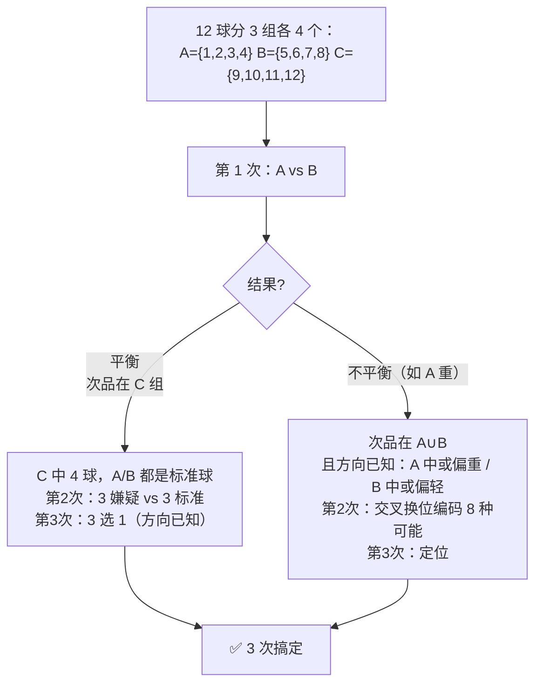

# P05. 12 个球天平称次品

## 📌 题目

12 个外观相同的小球，**11 个重量相同，1 个是次品**（**可能偏轻也可能偏重**，事先不知）。用一架天平，**最少称几次**能找出次品，并确定它是轻还是重？

🔗 经典通用题

## 🎯 考察

- **类型**：信息论
- **内核**：**三分法**——天平每称一次有 3 种结果（左重 / 平衡 / 右重），要用足这 3 个分支
- **出处**：经典智力题，称重类代表

## 🛒 人话理解 & 🧠 思路演进

### 为什么是 3 次？（信息论下界）

- 天平每称一次有 **3 种结果**，所以称 m 次最多区分 **3ᵐ** 种情况。
- 12 个球、每个可能轻或重 → **12 × 2 = 24 种**状态。
- 3² = 9 < 24 < 27 = 3³ → **至少需要 3 次**，且理论可行。

### 平衡分支（最直观，完整演示三分法）

假设第 1 次 `A vs B` **平衡** → 次品在 C 组 {9,10,11,12}，A、B 全是标准球：

1. **第 2 次**：取嫌疑球 `9,10,11` vs 标准球 `1,2,3`。
   - **平衡** → 次品是 `12`。第 3 次 `12 vs 1` 即知轻重。
   - **不平衡** → 次品在 `9,10,11`，且**方向已确定**（比如 `9,10,11` 这侧重，则次品是这 3 个里**偏重**的那个）。第 3 次 `9 vs 10`：平衡→`11`；否则重的那端就是次品。

### 不平衡分支（设计技巧）

假设第 1 次 `A 重 B 轻` → 次品要么在 A 中（偏重），要么在 B 中（偏轻），嫌疑集共 8 种。

> **关键技巧**：第 2 次不要直接称剩下的，而是**把球交叉换位 + 引入标准球**，让天平的"左重/平衡/右重"三种结果各对应一组互不重叠的嫌疑，从而把 8 种可能压缩到 3 种以内，第 3 次一称定位。

（具体配球方案有多种，面试讲清"交叉换位编码轻/重信息"这个思想 + 信息论下界，比死记某一种摆法更重要。）

## 💡 答案

**最少 3 次**（信息论下界 3³ = 27 ≥ 24，可达）。

## 🔁 举一反三

- **13 球只需找次品（不必知轻重）**：仍 3 次（24 + 1 种"全标准"= 25 ≤ 27）。
- **N 球**：所需次数 = ⌈log₃(2N)⌉（要知轻重）或 ⌈log₃(N+1)⌉（不知轻重）。
- **核心**：和 [P02 试毒](P02-小白鼠试毒.md) 同源——「一次操作榨取最多信息」。试毒是 base-2，称球是 base-3。
