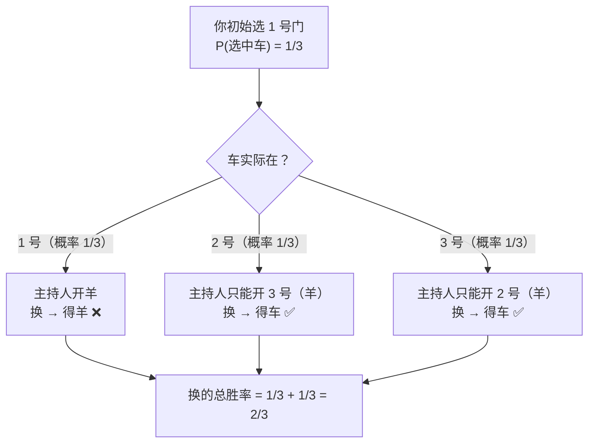

# P06. 蒙提霍尔三门问题

## 📌 题目

有 3 扇门，**1 扇后面是车，2 扇后面是羊**。你选了 1 号门（先不打开）。**主持人知道车在哪**，他从剩下的 2 扇门中打开一扇**后面是羊**的门。现在主持人问：**你要不要换成另一扇未开的门？**

🔗 概率题代表（外企 / 量化面试高频）

## 🎯 考察

- **类型**：概率
- **内核**：**条件概率**——别被"剩两扇门各 1/2"的直觉骗了
- **出处**：经典概率悖论，量化/算法岗爱考

## 🛒 人话理解 & 🧠 思路演进

### 直觉陷阱

很多人觉得："剩下 2 扇门，一扇车一扇羊，各 1/2，换不换无所谓。"——**错**。

### 正确推理

- 你**初始**选中的概率是 **1/3**。如果**坚持不换**，胜率就是 **1/3**。
- 主持人开门**不是随机的**：他知道车在哪，**必定避开车**。这个动作"泄露"了信息。
- 所以"换"的胜率 = **初始没选中**的概率 = **2/3**。

> 一句话：**换，等价于赌"我一开始选错了"；而一开始选错的概率是 2/3。**

### 极端放大（破直觉神器）

想象 **100 扇门**，1 车 99 羊。你选 1 号（胜率 1/100）。主持人打开 **98 扇羊门**，只剩你选的 1 号和另一扇。换不换？

当然换——换的胜率 = **99/100**。这下没人觉得是 1/2 了。

## 💡 答案

**一定要换**。换的胜率 **2/3**，不换只有 **1/3**。

## 🔁 举一反三

- **主持人不知道车在哪、随机开门恰好是羊**：那才是真的 1/2，换不换都行——区别全在"主持人是否带信息"。
- **三门问题变体（2 个主持人 / 多轮）**：用贝叶斯公式算条件概率。
- **核心**：概率题最常考的不是计算，而是**识别"新信息改变了样本空间"**——主持人的行为是有条件的，不是独立的。
