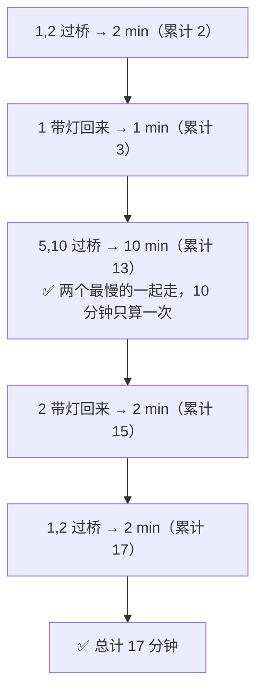

# P07. 4 人过桥（17 分钟）

## 📌 题目

4 个人夜晚过桥，**只有 1 个手电筒**，桥一次最多走 **2 人**，2 人同行时按**较慢者**的速度计时。4 人过桥分别需要 **1、2、5、10** 分钟。手电筒必须由人带回来。最少多久能让 4 人全部过桥？

🔗 经典通用题

## 🎯 考察

- **类型**：统筹优化
- **内核**：**贪心配对**——让两个最慢的人"搭伴"一次过桥，分摊掉最大的时间成本
- **出处**：经典统筹题

## 🛒 人话理解 & 🧠 思路演进

### 人话推理

- **难点**：手电筒要来回送，送灯的人会消耗时间，所以**让最快的两人（1、2）专门当"快递员"**。
- **关键决策**：两个最慢的（5、10）怎么过？
  - ❌ **错误直觉**：让最快的 1 分别陪 10、陪 5 过 → `10 + 1 + 5 + 1 + 2 = 19` 分钟。因为 10 和 5 **各算一次**，太亏。
  - ✅ **正确做法**：让 5 和 10 **搭伴一次过桥**，那个大数 `10` 只算一次；再让快的（2）把灯送回来。

### 完整步骤（最优 17 分钟）

| 步骤 | 动作 | 耗时 | 累计 |
|------|------|------|------|
| 1 | 1 和 2 过桥 | 2 | 2 |
| 2 | 1 带灯回来 | 1 | 3 |
| 3 | 5 和 10 过桥 | 10 | 13 |
| 4 | 2 带灯回来 | 2 | 15 |
| 5 | 1 和 2 过桥 | 2 | **17** |

> 注意第 4 步是 **2** 回来接人，不是 1——因为此时 1 已经在对岸，回来接人的是仍在起点侧的快手中较快者。这一步常被搞错。

## 💡 答案

**最少 17 分钟**（步骤见表）。

## 🔁 举一反三

- **N 人过桥通用策略**：两种贪心取优——
  ① 最快者来回送（`t1·(n-2) + t2 + Σ其他`）
  ② 两个最快先过、一个回来送灯、两个最慢一起过、另一个最快的回来（即本题套路）。
  对每对最慢的人比较 ①②，取小的。
- **核心**：和 [P01 赛马](P01-25匹马赛马.md) 同属统筹类——"让强者多跑腿，让弱者少消耗"。
