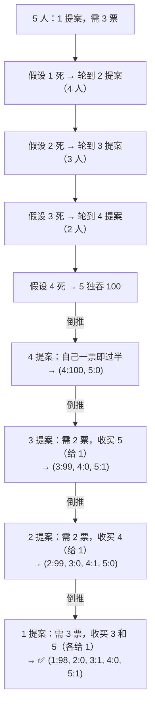

# P08. 海盗分金币

## 📌 题目

5 个海盗（按等级 **1 → 5**，1 号等级最高）要分 **100 枚金币**。规则：

1. 由**等级最高**的在世海盗先提分配方案；
2. 所有在世海盗（含提案者）**投票**，**≥ 半数同意**则方案通过、按此分发；
3. 否则提案者被**扔下海**，由下一位等级最高的提方案。

海盗的性格（优先级从高到低）：**保命 ＞ 多拿金币 ＞ 同等收益时倾向于扔人**。问：**1 号的最优方案**是什么？

🔗 字节 / 金融科技面试高频

## 🎯 考察

- **类型**：博弈推理
- **内核**：**逆向归纳（backward induction）**——从只剩 1 人时倒推每一步
- **出处**：博弈论经典，字节、量化/金融科技爱考

## 🛒 人话理解 & 🧠 思路演进

### 逆向归纳（核心方法）

从**人最少**的情况往回推，每一步都假设"提案者已死"，看下一个人会怎么分，再据此设计当前方案。

| 轮到谁 | 在世海盗 | 需几票 | 倒推依据 | 方案 |
|--------|---------|--------|---------|------|
| 5 | 只有 5 | 1 | 独吞 | **5: 100** |
| 4 | 4, 5 | 1（2 人半数=1，自己一票即过） | 若 4 死→5 得 100 | **4: 100, 5: 0** |
| 3 | 3, 4, 5 | 2 | 若 3 死→4:100, **5:0**；故收买 5（给 1） | **3: 99, 4: 0, 5: 1** |
| 2 | 2, 3, 4, 5 | 2（4 人半数=2，自己+1 票） | 若 2 死→3:99, **4:0**, 5:1；故收买 4（给 1） | **2: 99, 3: 0, 4: 1, 5: 0** |
| **1** | 1, 2, 3, 4, 5 | 3（5 人半数=3，自己+2 票） | 若 1 死→2:99, **3:0**, 4:1, **5:0**；故收买 3 和 5（各给 1） | **1: 98, 2: 0, 3: 1, 4: 0, 5: 1** |

**为什么收买 3 号和 5 号？** 因为"如果 1 号死了"，在 2 号的方案里 **3 号和 5 号都只能拿到 0**。所以 1 号只要各给他们 **1 枚**（1 > 0，严格更优），他们就一定会同意——既保命又比下轮拿得多。

## 💡 答案

**1 号方案：自己 98 枚，给 3 号 1 枚、5 号 1 枚，2 号和 4 号各 0 枚。**

> 即 `1:98, 2:0, 3:1, 4:0, 5:1`。1 号凭借"先发提案权 + 精准收买"，几乎独吞 100 枚。

## 🔁 举一反三

- **规则变体：> 半数（而非 ≥）才通过**：需要的票数变多，1 号要收买更多人，自己留得更少。
- **500 个海盗分 100 金币**：金币不够分，会出现"0 金币 + 扔人偏好"的反直觉结果（海盗会倒贴感谢）。
- **核心**：逆向归纳是所有"轮流提案/博弈"题的通用武器——**永远从最后一个决策者倒推**，每个玩家都假设"前一个会被否决"。这与动态规划的思想一脉相承。
